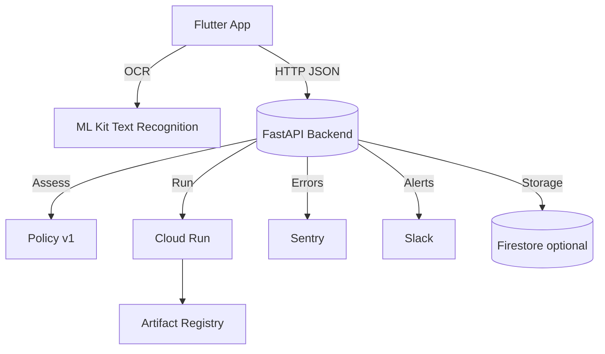

# Architecture

```mermaid
flowchart TD
  A[Flutter App] -->|OCR| B[ML Kit Text Recognition]
  A -->|HTTP JSON| C[(FastAPI Backend)]
  C -->|Assess| D[Policy v1]
  C -->|Run| E[Cloud Run]
  E --> F[Artifact Registry]
  C -->|Errors| G[Sentry]
  C -->|Alerts| H[Slack]
  C -->|Storage| I[(Firestore optional)]
```
