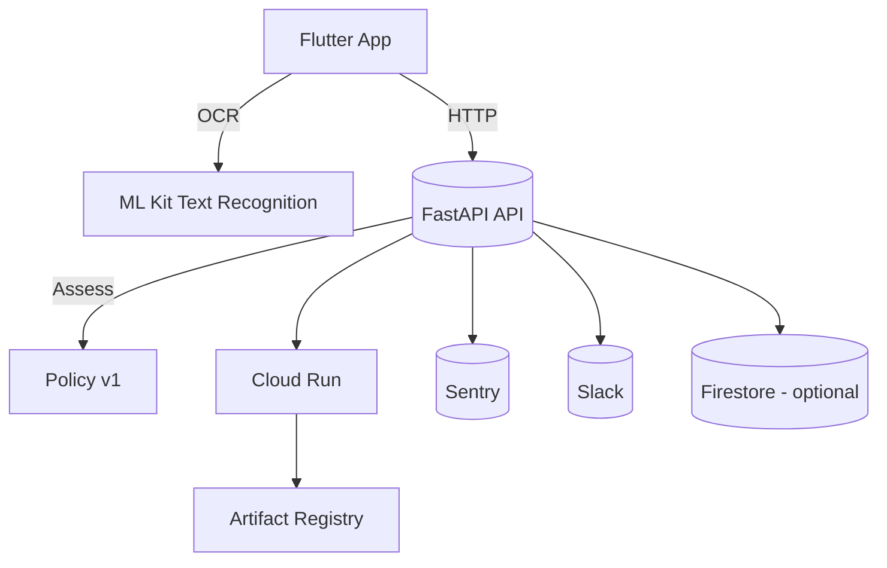

# Architecture

```mermaid
flowchart TD
  Mobile[Flutter App] -- OCR --> OCR[ML Kit Text Recognition]
  Mobile -- HTTP --> Backend[(FastAPI API)]
  Backend -- Assess --> Policy[Policy v1]
  Backend --> CloudRun[Cloud Run]
  CloudRun --> AR[Artifact Registry]
  Backend --> Sentry[(Sentry)]
  Backend --> Slack[(Slack)]
  Backend --> Firestore[(Firestore - optional)]
```
