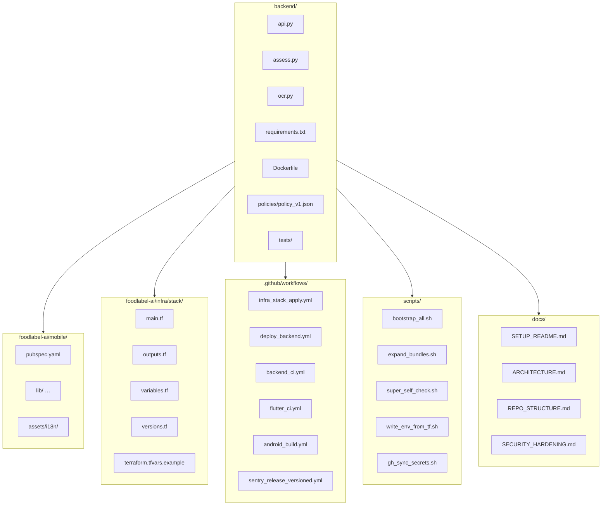

# Repository Structure

This repository contains the full FoodLabel AI system, organized into four main parts:

- **Mobile app (Flutter)** – Cross-platform app (Android, iOS, Windows, macOS) with OCR.
- **Backend (FastAPI)** – Provides `/v1/ocr` (Google Vision) and `/v1/assess` (ingredient scoring).
- **Infrastructure (Terraform)** – Provisions GCP resources: Workload Identity Federation, Cloud Run, Artifact Registry, Vision API.
- **Automation (GitHub Actions + Scripts)** – CI/CD workflows, infra management, Sentry/Slack integration, bootstrap helpers.
- **Documentation** – Setup, architecture diagrams, security hardening, repo overview.

---

## Visual Overview

backend/                        # FastAPI backend
  api.py                        # Entry point, mounts assess + ocr routes
  assess.py                     # Ingredient assessment logic & API
  ocr.py                        # OCR endpoint (Google Vision API)
  requirements.txt              # Python dependencies
  Dockerfile                    # Container build for backend
  policies/policy_v1.json       # Rules for ingredient scoring
  tests/                        # Pytest-based backend tests

foodlabel-ai/mobile/            # Flutter app (mobile + desktop)
  pubspec.yaml                  # Flutter project config & dependencies
  lib/                          # Dart source (pages, services, widgets)
  assets/i18n/                  # Translations (en, nl_BE, fr_BE)

foodlabel-ai/infra/stack/       # Terraform infrastructure stack
  main.tf                       # GCP resources (APIs, WIF, Cloud Run, etc.)
  outputs.tf                    # Terraform outputs (project_id, etc.)
  variables.tf                  # Terraform variables
  versions.tf                   # Terraform + provider versions
  terraform.tfvars.example      # Example config (project_id, etc.)

.github/workflows/              # GitHub Actions CI/CD workflows
  infra_stack_apply.yml         # Provision infra with Terraform
  deploy_backend.yml            # Build + deploy backend to Cloud Run
  backend_ci.yml                # Backend lint/test workflow
  flutter_ci.yml                # Flutter lint/test workflow
  android_build.yml             # Android build (APK/AAB)
  sentry_release_versioned.yml  # Sentry release automation

scripts/                        # Utility scripts
  bootstrap_all.sh              # Bootstraps repo (chmods, expands bundles, self-check)
  expand_bundles.sh             # Extracts child zips into repo
  super_self_check.sh           # Verifies presence of critical files
  write_env_from_tf.sh          # Writes Terraform outputs to .env.ci
  gh_sync_secrets.sh            # Syncs .env.ci to GitHub repo secrets/vars

docs/                           # Documentation
  SETUP_README.md               # Setup guide (Windows/macOS/Android/iOS)
  ARCHITECTURE.md               # Mermaid diagram of system architecture
  REPO_STRUCTURE.md             # This file
  SECURITY_HARDENING.md         # Hardening checklist (WIF, IAM, secrets, CI/CD)
